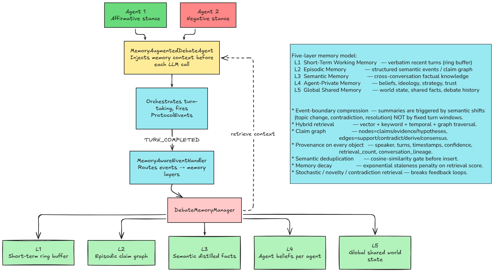

# Logorrhea: Multi Agent AI Debate System

A multi-agent conversational framework that orchestrates autonomous debates between AI agents, with a hierarchical memory architecture.

## Philosophy

Some questions I like to see being answered:
- How arguments evolve and deteriorate over long conversations?
- Whether novel insights emerge from extended dialectics?
- Do arguments become circular, do they converge towards a point, or shift into some absurdity?
- How positions shift (or don't) without external validation?


## Architecture

  


## Installation

### Setup

```bash
# Clone the repository
git clone https://github.com/nihilisticneuralnet/Logorrhea.git
cd Logorrhea

# Install dependencies
pip install -r requirements.txt

# Insert your API keys
export GROQ_API_KEY="your_groq_api_key_here" # or hf_token (any one)

# Run tests
cd src
python main.py

# For gradio interface, use
python app.py
```


## Example 
Topic: Would you go back in time and kill baby Hitler?


https://github.com/user-attachments/assets/a88e1270-bbd9-4245-840c-c2eef44f189c


## References
- https://jamez.it/project/the-infinite-conversation/
- https://huggingface.co/hexgrad/Kokoro-82M
- https://huggingface.co/spaces/MohamedRashad/Orpheus-TTS
